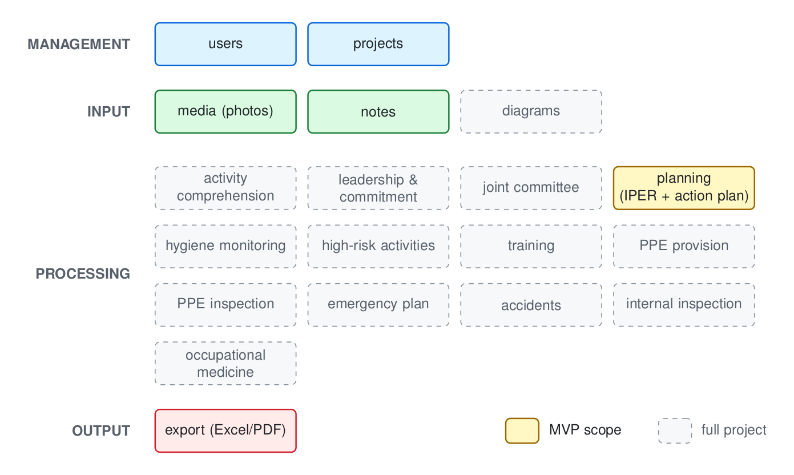

# Automated System for Occupational Health and Safety Management

Software to help Bolivian occupational health and safety (SySO) professionals plan and generate PGSST documents under the Technical Safety Standard **NTS-009/23**, cutting the time spent on manual form filling and risk-matrix authoring.

The core loop: field evidence (workplace photos + notes) goes in, a multimodal model extracts the qualitative facts, a deterministic rubric engine computes every risk index, the professional reviews and edits the resulting IPER matrix, and the system derives the action plan and exports the official documents.

## Architecture

The application is organized in four layers: Management, input, processing, and output. Where each processing module automates one technical content point of the NTS-009/23 standard. The full project aims to cover the entire module map; the MVP (colored modules) delivers the end-to-end slice that matters most: project management, photo/note capture, IPER matrix + action plan generation, and export of the official documents.

<picture>
  <source media="(prefers-color-scheme: dark)" srcset="docs/images/architecture-dark.png">
  
</picture>

The diagram source lives in [`docs/images/architecture.tex`](docs/images/architecture.tex) (build instructions in the file header).

## Status

The project is transitioning from thesis proposal and exploratory prototypes to an MVP. Progress is tracked through the [GitHub issues](https://github.com/leonardoAB1/SySO_automation/issues) of this repository.

## MVP direction

| Layer | Choice |
|---|---|
| Web app | Next.js (App Router, TypeScript, Tailwind), lives in `app/` in this repo |
| Backend | Supabase (auth, Postgres with RLS, storage) — free tier |
| AI | Locally hosted vision models (Ollama) behind a provider-agnostic OpenAI-compatible adapter; swappable to a hosted API once validated |
| Risk scoring | Deterministic TypeScript port of the NTS rubric (INPE, IFDE, ICO, severity). The LLM never computes indices, only extracts qualitative fields as structured JSON |
| Export | Excel/PDF matching the official IPER and PGSST templates |
| Deploy | Own Vercel project (root directory `app/`) at `syso.leonardoachaboiano.com` |

Key design rules:

- **Human in the loop**: legally, a registered Cat-A professional must approve every document. Generated content is always reviewable and editable, and edits are preserved alongside the raw model output for auditability.
- **Provider-agnostic AI**: generation runs against any OpenAI-compatible endpoint, starting cost-free with local models.

## Dataset workstream

In parallel with the MVP, this project is building an open, structured corpus of real-world IPER/IPERC risk matrices scraped from public sources in Bolivia and Peru (ministry portals, university repositories, public tenders). It serves as the MVP's evaluation benchmark and is intended for standalone publication (Hugging Face + Zenodo) with an accompanying dataset paper.

## Roadmap

1. **Validation spike**: standalone CLI pipeline (photos + notes → IPER Excel) tested on real cases; go/no-go on local-model extraction quality, judged against scraped gold examples.
2. **App skeleton**: scaffold `app/`, Supabase auth and schema, project CRUD, media upload, deploy.
3. **IPER in the app**: generation endpoint, review/edit matrix UI, audit trail, Excel export.
4. **Plan de Acción**: derive action items from the finalized matrix, exports, timing telemetry.
5. **Pilot**: evaluation with 5 professionals measuring time reduction; dataset publication.

## Repository structure

- `app/` — MVP web application (planned, see roadmap).
- `dataset/` — IPER corpus scraping and curation pipeline (planned).
- `docs/thesis/` — LaTeX thesis document (Spanish). Entry point `main.tex`; compiled with `pdflatex` + `biber`.
- `prototypes/` — legacy exploratory prototypes: `iper/` (rubric and IPER generation with an early LLM pipeline, source of the scoring rules), `danger_detection/` (PPE computer vision), `gui/`.

## Background

NTS-009/23 (approved by Ministerial Resolution 992/23) establishes mandatory guidelines for Occupational Health and Safety Management Programs (PGSST) in Bolivia. Approved programs are valid for three years with annual reporting through the Ministry of Labor's web portal, so companies approved in 2023-2024 face renewal in 2026-2027. Effective implementation remains difficult due to the scarcity of specialized professionals and the complexity and volume of the required documentation; this project addresses that bottleneck.

The academic side of the project (problem statement, objectives, requirements analysis, and evaluation methodology) is developed in the thesis under `docs/thesis/`.

## License

This project is under the [MIT License](LICENSE).
