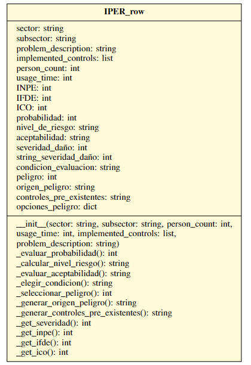

# Prototipos del Proyecto

Este directorio contiene prototipos desarrollados para el proyecto "Sistema de Automatización de Programas de Salud y Seguridad en el Trabajo en base a la Norma Técnica de Seguridad 009". Estos prototipos abarcan desde la interfaz gráfica hasta el análisis de información y la gestión de riesgos ocupacionales.

## Descripción de los Prototipos

### Interfaz Gráfica

La carpeta de prototipos incluye representaciones iniciales de la interfaz de usuario diseñada para el sistema. Se muestran modelos conceptuales y bosquejos que evolucionaron hasta llegar a la representación final de la interfaz.

La interfaz se estructura en cinco partes principales: Pestañas de contenido técnico, panel de visualización del estado actual del proyecto, resumen de métricas relevantes, barra de herramientas y sección de entrada de información. Este diseño permite una navegación intuitiva y una fácil interacción con el sistema.

### Análisis de Información

Se utilizaron modelos de redes neuronales preentrenados en conjuntos de datos amplios para identificar incumplimientos de seguridad en entornos laborales.

### Gestión de Riesgos Ocupacionales

Se ha desarrollado un prototipo para la gestión de riesgos ocupacionales, centrándose en la metodología de la Matriz de Identificación de Peligros y Evaluación de Riesgos (IPER). Se han diseñado clases en Python para encapsular la información contenida en una fila de la matriz IPER, facilitando su manipulación y análisis.

